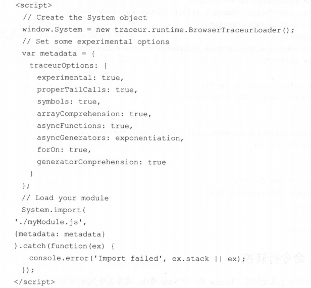
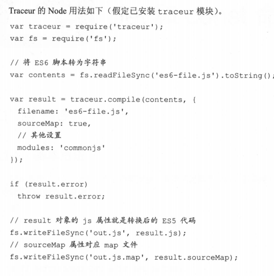

# ECMAScript 6

## Babel转码器

1. 各大浏览器最新版本对于 ES6 的支持，可以参阅 [ES6](http://kangax.github.io/compat-table/es6/)

2. node --vs-options I grep harmony  

3. 查看本机对 ES6 的支持程度   

   - npm install -g es-checker  
   - es-checker  

4. .babelrc

   - ```json
     {
         "presets":[
             "latest",
             "react",
             "stage-2"
         ], //设定转码规则
         "plugins":[]  //
     }
     ```

     

   - ```javascript
     ＃最新转码规则
     $ npm install --save -dev babel-preset-latest
     # react 转码规则
     $ npm install --save-dev babel-preset-react
     ＃不同阶段语法提案的转码规则（共有 4 个阶段），选装一个
     $ npm install --save-dev babel-preset-stage-0
     $ npm install --save-dev babel-preset-stage-1
     $ npm install --save-dev babel-preset-stage-2
     $ npm install --save-dev babel-preset-stage-3
     ```

     

5. 命令行转码babel-cli

   - ```
     它的安装命令如下。
     $ npm install --global babel-cli
     基本用法如下。
     ＃转码结采输出到标准输出
     $ babel example.js
     ＃转码结果写入一个文件
     # --out-file 或 -o 参数指定输出文件
     $ babel example.js --out-file compiled.js
     ＃或者
     $ babel example.js -o compiled.js
     ＃整个目录转码
     # --out-dir 或－ d 参数指定输出目录
     $ babel src --out-dir lib
     ＃或者
     $ babel src -d lib
     # -s 参数生成 source map 文件
     $ babel src -d lib -s
     ```

   - 本地安装babel

     - ```
       npm install --save-dev babel-cli
       //改写package.json文件
       "devDependencies":{
       	"babel-cli":"^6.0.6"
       },
       "scripts":{
       	"build":"babel src -d lib"
       }
       //转码命令 npm run build
       ```

   - babel-node,提供一个支持es6的REPL环境。

     - ```
       //直接运行命令
       babel-node 
       //直接运行es6脚本
       babel-node es6.js
       //安装到项目中
       npm install --save-dev babel-cli
       //改写package.json
       "scripts":{
       	"script-name":"babel-node scripts.js"
       }
       ```

     - 使用babel-node代替node，scripts.js本省就可以不用任何转码处理了

   - babel-register,改写了require命令，加入钩子，每当使用require加载后缀为js,jsx,es和es6的文件时候，会先babel进行转码

     - ```
       $ npm install --save-dev babel - register
       使用时，必须首先加载 babel-register 。
       require (” babel - register” );
       require (” . / index . j s ”);
       这样便不需要手动对 index. j s 进行转码了 。
       ```

     - babel-register 只会对 require 命令加载的文件进行转码，而不会对当前文件进行
       转码。 另外，由于它是实时转码，所以只适合在开发环境中使用  

   - babel-core，在某些代码需要调用babel的API进行转码时要用到

     - 

   - babel-polyfill ,Babel 默认只转换新的 Java Script 句法（ syntax ），而不转换新的 API ，如 Iterator 、
     Generator 、 Set 、 Maps 、 Proxy 、 Reflect 、 Symbol 、 Promise 等全局对象，以及一些定义在全局对象上的方法（如 Object . assign ）都不会转码。  如果想让这个方法运行，必须使用 babel-polyfill 为当前环境提供一个垫片。  

     - ```
       npm install --save babel-polyfill
       然后，在脚本头部加入如下代码。
       import ’ babel - polyfill ’;
       //或者
       require ( ’ babel-polyfill ’);
       ```

     - Babel默认不转码的API。[babel -plugin-t ransformruntime 模块的 definitions .js]()

   - 浏览器环境

     - 从 Babe l 6 . 0 开始将不再直接提供浏览器版本 ， 而是
       要用构建工具构建出来。如果没有或不想使 用 构建工具 ， 可以使用 babel-standalone
       ( github.com/Daniel 15/babel-standalone ）模块提供的浏览器版本，将其插入网页。 

     - 网页实时将 ES6 代码转为 ES5 代码 ， 对性能会有影响 。 生产环境下 需加载 已转码的
       脚本 。   

     - ```
       //配合broswerify，babel打包成浏览器可以使用的脚本
       npm install --save-dev babelify babel-preset-latest
       //然后用命令转换es6脚本
       browserify script.js -o bundle.js -t [babelify --presets [latest]]
       //package.json加入一下代码
       "browserify":{
       	"transform":[["babelify",{"presets":["latest"]}]]
       }
       ```

   - [在线转换](babeljs.io/repl/)

   - 和其他工具配合

     - eslint，mocha需要babel进行前置转码

     - ```
       //.eslintrc
       npm install --save-dev eslint babel-eslint
       "parser":"babel-eslint",
       "rules":{
       	...
       }
       //配合package.json
       "name":"my-module",
       "scripts":{
       	"lint":"eslint my-files.js"
       },
       "devDependencies":{
       	"babel-eslint":"...",
       	"eslint":"..."
       }
       ```

     - ```
       //mocha测试框架
       "scripts":{
       	"test":"mocha --ui qunit --compilers js:babel-core/register"
       }
       //--compilers指定脚本的转换器，规定js结尾的文件你需要babel-core/register先进行转码
       ```

       

## traceul转码器

traceur（Google）,必须在头部加载traceul库文件

```javascript
<script src=” https://google . github . io/traceur-compiler..」
/bin / traceur . js ” ></script>
<script src=” https : //google . github . io / traceur-compiler,_i
/bin/BrowserSystem.j s ” ></ s cript>
<script src=” https : //google . github . io/traceur-compiler,_i
/src / bootstrap.j s ” ></script>
<script type=” module ” >
import ’. / Greeter.js ’;
</script>
//第一个用来加载traceul文件，第二三个用于浏览器环境。第一个用来加载es6代码(type为module，实别ES6代码的标志)
// 也可以直接在页面中放置ES6代码
```



traceur的全局对象。system.import加载ES6,配置对象metadata.traceurOptions属性配置支持ES6.

experimental:true.表示除了ES6外还支持一些实验性新功能。

1. 命令行转换
   - npm i -g traceul
   - traceul --script  ES6.js --out calc.es5.js  //指定输入输出，--experimental选项支持更多新特性
2. Node环境的用法
   - 

# Let和const

块级作用域

```javascript

```

对象冻结，Object.freeze();

```javascript
const foo = Object.freeze({});

// 常规模式时，下面一行不起作用；
// 严格模式时，该行会报错
foo.prop = 123;
//常量foo指向一个冻结的对象，所以添加新属性不起作用，严格模式时还会报错。
```

对象的属性冻结

```javascript
var constantize = (obj) => {
  Object.freeze(obj);
  Object.keys(obj).forEach( (key, i) => {
    if ( typeof obj[key] === 'object' ) {
      constantize( obj[key] );
    }
  });
};
```

顶级对象的属性

```javascript
var a = 1;
// 如果在 Node 的 REPL 环境，可以写成 global.a
// 或者采用通用方法，写成 this.a
window.a // 1

let b = 1;
window.b // undefined
//全局变量a由var命令声明，所以它是顶层对象的属性；全局变量b由let命令声明，所以它不是顶层对象的属性，返回undefined。
```

globalThis对象

```javascript
JavaScript 语言存在一个顶层对象，它提供全局环境（即全局作用域），所有代码都是在这个环境中运行。但是，顶层对象在各种实现里面是不统一的。
//在所有情况下，都取到顶层对象
// 方法一
(typeof window !== 'undefined'
   ? window
   : (typeof process === 'object' &&
      typeof require === 'function' &&
      typeof global === 'object')
     ? global
     : this);

// 方法二
var getGlobal = function () {
  if (typeof self !== 'undefined') { return self; }
  if (typeof window !== 'undefined') { return window; }
  if (typeof global !== 'undefined') { return global; }
  throw new Error('unable to locate global object');
};
//ES2020 在语言标准的层面，引入globalThis作为顶层对象。也就是说，任何环境下，globalThis都是存在的，都可以从它拿到顶层对象，指向全局环境下的this。

垫片库global-this模拟了这个提案，可以在所有环境拿到globalThis。
```


# 变量解构和赋值

ES6 允许按照一定模式，从数组和对象中提取值，对变量进行赋值，这被称为解构（Destructuring）。

```javascript
//基本用法
let [x, y, ...z] = ['a'];
x // "a"
y // undefined
z // []

//如果解构不成功，变量的值就等于undefined。
// foo的值都会等于undefined。
let [foo] = [];
let [bar, foo] = [1];

// 不完全解构
let [x, y] = [1, 2, 3];
x // 1
y // 2

let [a, [b], d] = [1, [2, 3], 4];
a // 1
b // 2  ，这里就是拿了第一个
d // 4

//如果等号的右边不是数组（或者严格地说，不是可遍历的结构，参见《Iterator》一章），那么将会报错。
//等号右边的值，要么转为对象以后不具备 Iterator 接口（前五个表达式），要么本身就不具备 Iterator 接口（最后一个表达式）。
// 报错
let [foo] = 1;
let [foo] = false;
let [foo] = NaN;
let [foo] = undefined;
let [foo] = null;
let [foo] = {};


// Set 结构，也可以使用数组的解构赋值。
let [x, y, z] = new Set(['a', 'b', 'c']);
x // "a"

//事实上，只要某种数据结构具有 Iterator 接口，都可以采用数组形式的解构赋值。
//fibs是一个 Generator 函数（参见《Generator 函数》一章），原生具有 Iterator 接口。解构赋值会依次从这个接口获取值。
function* fibs() {
  let a = 0;
  let b = 1;
  while (true) {
    yield a;
    [a, b] = [b, a + b];
  }
}

let [first, second, third, fourth, fifth, sixth] = fibs();
sixth // 5
```


```javascript
//默认值
//解构赋值允许指定默认值。
//ES6 内部使用严格相等运算符（===），判断一个位置是否有值。所以，只有当一个数组成员严格等于undefined，默认值才会生效。
let [x = 1] = [undefined];
x // 1

let [x = 1] = [null];
x // null


//默认值是一个表达式，那么这个表达式是惰性求值的，即只有在用到的时候，才会求值。
function f() {
  console.log('aaa');
}

let [x = f()] = [1];
//因为x能取到值，所以函数f根本不会执行。上面的代码其实等价于下面的代码。
let x;
if ([1][0] === undefined) {
  x = f();
} else {
  x = [1][0];
}


//默认值可以引用解构赋值的其他变量，但该变量必须已经声明。
let [x = 1, y = x] = [];     // x=1; y=1
let [x = 1, y = x] = [2];    // x=2; y=2
let [x = 1, y = x] = [1, 2]; // x=1; y=2
let [x = y, y = 1] = [];     // ReferenceError: y is not defined
//最后一个表达式之所以会报错，是因为x用y做默认值时，y还没有声明。
```


```javascript
//对象的解构赋值
//对象的解构与数组有一个重要的不同。数组的元素是按次序排列的，变量的取值由它的位置决定；而对象的属性没有次序，变量必须与属性同名，才能取到正确的值。
//如果解构失败，变量的值等于undefined。

//将现有对象的方法，赋值某个变量上
let { log, sin, cos } = Math;
const { log } = console;
log('hello') // hello
// 如果变量名与属性名不一致，必须写成下面这样。
let { foo: baz } = { foo: 'aaa', bar: 'bbb' };
baz // "aaa"

let obj = { first: 'hello', last: 'world' };
let { first: f, last: l } = obj;
f // 'hello'
l // 'world'
// 原理，对象的解构赋值的内部机制，是先找到同名属性，然后再赋给对应的变量。真正被赋值的是后者，而不是前者。
let { foo: baz } = { foo: 'aaa', bar: 'bbb' };
baz // "aaa"
foo // error: foo is not defined
//foo是匹配的模式，baz才是变量。真正被赋值的是变量baz，而不是模式foo。


const node = {
  loc: {
    start: {
      line: 1,
      column: 5
    }
  }
};

let { loc, loc: { start }, loc: { start: { line }} } = node;
line // 1
loc  // Object {start: Object}
start // Object {line: 1, column: 5}

//上面代码有三次解构赋值，分别是对loc、start、line三个属性的解构赋值。注意，最后一次对line属性的解构赋值之中，只有line是变量，loc和start都是模式，不是变量。
```


# 字符串的扩展

# 正则的扩展

# 数值扩展

# 函数扩展

# 数组的扩展

# 对象的扩展

# Symbol

# Set和Map的数据结构

# Proxy

# Reflect

# Promise对象

# Iterator和for...of循环

# 第16章 Generator函数的语法

# 第17章 Generator函数的异步应用

# 第18章 async函数

# 第19章 Class的基本语法

# 第20章 Class的继承

# 第21章 修饰器

# 第22章 Module的语法

# 第23章 Module的加载实现

# 第24章 编程风格

# 第25章 读懂ECMAScript规格

# 第26章 ArrayBuffer