# chapter1

## webpack 查看命令

```cmd
.\node_modules\.bin/webpack -v
```

# chapter2

## entry：

```json
//单⼊⼝： entry 是⼀个字符串 多⼊⼝： entry 是⼀个对象
module.exports = {
	entry: './path/to/my/entry/file.js'
};
module.exports = {
    entry: {
    app: './src/app.js',
    adminApp: './src/adminApp.js'
    }
};
```

## output:

```json
单入口：
module.exports = {
    entry: './path/to/my/entry/file.js'
    output: {
        filename: 'bundle.js’ ,
        path: __dirname + '/dist'
    }
};
多入口：通过占位符保证文件名称的唯一
module.exports = {
    entry: {
        app: './src/app.js',
        search: './src/search.js'
    },
    output: {
        filename: '[name].js',
        path: __dirname + '/dist'
    }
};
```

## loaders: 

**test指定匹配规则，use指定使用loader名称**

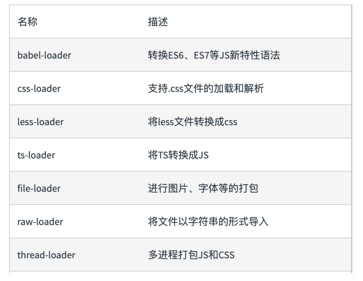

```json
module: {
    rules: [
    	{ test: /\.txt$/, use: 'raw-loader' }
    ]
}
```

## plugins数组:

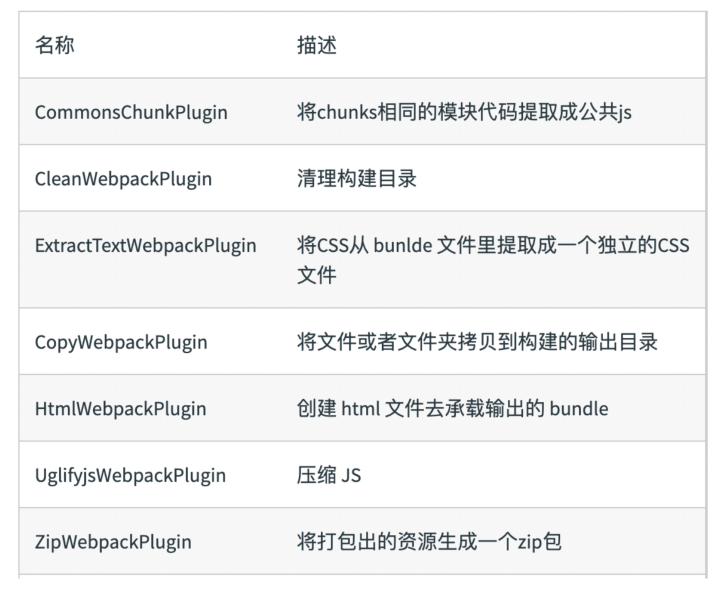

```json
plugins: [
	new HtmlWebpackPlugin({template:'./src/index.html'})
]
```

## mode:

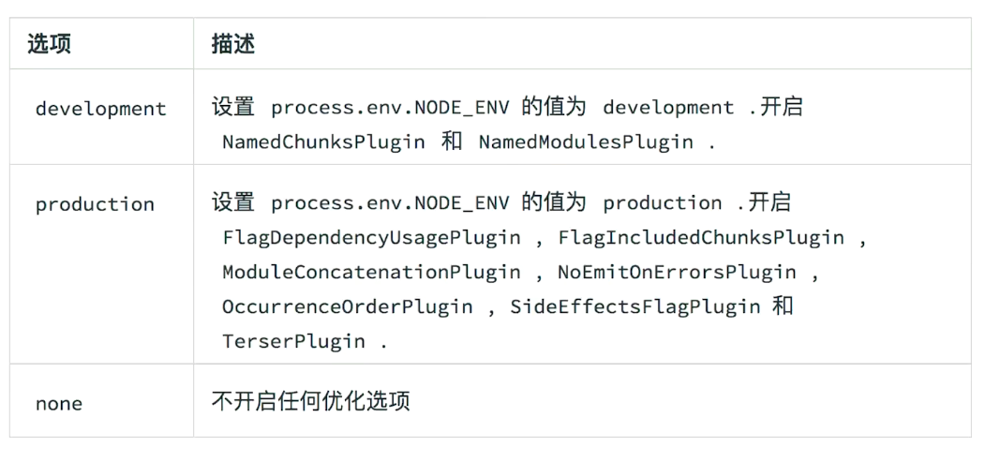

## 解析 ES6  


```json
npm i @babel/core @babel/preset-env babel-loader -D

+ module: {
    + rules: [
        + {
            + test: /\.js$/,
            + use: 'babel-loader'
        + }
	+ ]
+ }


```

```json
//.babelrc文件
//增加ES6的babel preset配置
{
    "presets": [
        + "@babel/preset-env”
    ],
    "plugins": [
   	 "@babel/proposal-class-properties"
    ]
}
```

## 解析 React JSX  

.babelrc文件

```json
npm i @babel/core @babel/preset-env babel-loader -D
npm i react-dom @babel/preset-react -D
+ module: {
    + rules: [
        + {
            + test: /\.js$/,
            + use: 'babel-loader'
        + }
	+ ]
+ }


```

```json
//增加React的babel preset配置
{
    "presets": [
        + "@babel/preset-env”,
        + "@babel/preset-react"
    ],
    "plugins": [
   	 "@babel/proposal-class-properties",
    ]
}
```

## CSS解析：

```json
// npm install style-loader css-loader less less-loader -D
+ module: {
    + rules: [
        + {
            + test: /\.css$/,
            + use: [
            + 'style-loader',//将样式通过 <style> 标签插⼊到 head 中
            + 'css-loader'//加载 .css ⽂件，并且转换成 commonjs 对象
            + ]
			//从后往前解析，style-loader排在第一
        + },
		  + {
            + test: /\.less$/,
            + use: [
            + 'style-loader',
            + 'css-loader',
    		  'less-loader'
            + ]
			//从后往前解析，style-loader排在第一
        + }
    + ]
+ }
```

## 图片解析：

```json
npm install file-loader -D
module: {
    rules: [
        + {
            + test: /\.(png|svg|jpg|gif|jpeg)$/,
            + use: [
            + 'file-loader'
            + ]
        + }
    ]
}
```

## 字体解析：

```json
npm install file-loader -D
+ module: {
    rules: [
      {
        + test: /\.(woff|woff2|eot|ttf|otf)$/,
        + use: [
        	+ 'file-loader'
        + ]
    + }
    ]
+ }
```

## 资源解析：

url-loader处理图片和字体，设置较小的资源自动base64

```json
npm install url-loader -D
+ module: {
    + rules: [
       {
        + test: /\.(png|svg|jpg|gif|jped)$/,
        + use: [{
            + loader: 'url-loader’,
            + options: {
                + limit: 10240 //小于10KB大小会被base64
    		+ }
        + }]
   	 + }
    + ]
+ }
```

## 文件监听：

​	两种方式：启动webpack时，--watch参数

​						配置webpack.config.js中设置watch:true;

   缺陷：手动刷新浏览器

```json
//package.json
"scripts": {
    "build": "webpack ",
    + "watch": "webpack --watch"
},
```

文件监听原理：轮询判断文件的最后编辑时间，然后缓存起来等aggregateTimeout

```json
module.export = {
    //默认 false，也就是不开启
    watch: true,
    //只有开启监听模式时， watchOptions才有意义
    wathcOptions: {
        //默认为空，不监听的文件或者文件夹，支持正则匹配
        ignored: /node_modules/,
        //监听到变化发生后会等300ms再去执行，默认300ms
        aggregateTimeout: 300,
        //判断文件是否发生变化是通过不停询问系统指定文件有没有变化实现的，默认每秒问1000次
        poll: 1000
    }
}
```

## 热更新：

 **webpack-dev-server**  搭配**HotModuleReplacementPlugin插件**  ,不刷新浏览器，不输出文件而是放在内存中。

```json
//webpack-dev-server在开发状态下使用
//webpack.config.js
const webpack=require('webpack');//自带HotModuleReplacementPlugin
mode:'development',
plugins:[
    new webpakc.HotModuleReplacementPlugin()
],
devServer:{
    contentBase:'./dist',//监听的目录
    hot:true //开启热更新
}


//package.json
"scripts": {
    "build": "webpack ",
   + ”dev": "webpack-dev-server --open"
},
```

热更新： 使⽤ **webpack-dev-middleware**  .WDM 将 webpack 输出的⽂件传输给服务器  

```json
//webpack.config.js
const express = require('express');//需要使用服务器express或koa
const webpack = require('webpack');
const webpackDevMiddleware = require('webpack-devmiddleware');

const app = express();

const config = require('./webpack.config.js');

const compiler = webpack(config);
app.use(webpackDevMiddleware(compiler, {
    publicPath: config.output.publicPath
}));
app.listen(3000, function () {
	console.log('Example app listening on port 3000!\n');
});
```

热更新的原理分析  

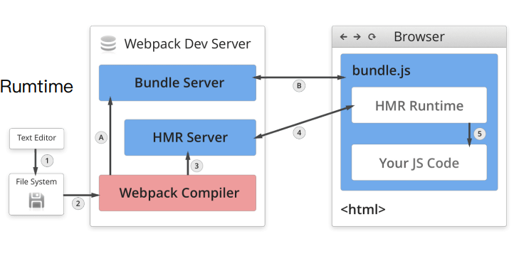

1. Webpack Compile: 将 JS 编译成 Bundle  
2. HMR Server: 将热更新的⽂件输出给 HMR Rumtime  
3. Bundle server（客户端）: 提供⽂件在浏览器的访问  
4. HMR Runtime（服务端）: 会被注⼊到浏览器，
   更新⽂件的变化  
5. bundle.js: 构建输出的⽂件  
6. **BundleServer和HMR Runtime通常是websocket链接**


## 文件指纹：

打包后输入的文件名的后缀（生成模式下使用，不能与HotModuleReplacementPlugin一起使用）

1. **Hash**：**和整个项⽬的构建相关**，只要**项⽬⽂件有修改**，整个项⽬构建的 hash 值就会更改
2. **Chunkhash：和 webpack 打包的 chunk 有关**，不同的 entry 会⽣成不同的 chunkhash 值
3. **Contenthash**：**根据⽂件内容来定义 hash** ，⽂件内容不变，则 contenthash 不变  

```json
//JS文件:设置output的filename,使用[chunkhash]
output: {
    + filename: '[name]_[chunkhash:8].js',
    path: __dirname + '/dist'
}

//MiniCssExtractPlugin(写作：MiniCssExtractPlugin.loader)不能和style-loader一起使用
//npm i mini-css-extract-plugin -D
//CSS文件：设置 MiniCssExtractPlugin (抽离CSS单文件)的 filename，使⽤ [contenthash]
rules:[
    {test:/\.css$/,
     use:[
         MiniCssExtractPlugin.loader,//替换原来的style-loader
         'css-loader'
     ]
    }
],
plugins: [
    + new MiniCssExtractPlugin({
   		 + filename: `[name]_[contenthash:8].css`
    + });
]


//图片文件：设置 file-loader 的 name，使⽤ [hash]
rules: [
    {
        test: /\.(png|svg|jpg|gif)$/,
        use: [{
        loader: 'file-loader’,
        + options: {
        	+ name: 'img/[name]_[hash:8].[ext] '
        + }
        }]
    }
]
```

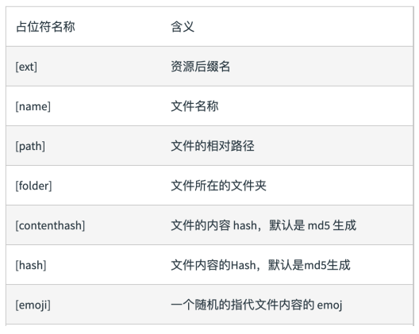

## 代码压缩：

```json
//JS压缩：webpack4内置uglifyjs-webpack-plugin

//CSS压缩：使⽤ optimize-css-assets-webpack-plugin
//同时使⽤ cssnano 预处理器
//npm install optimize-css-assets-webpack-plugin cssnano -D 
plugins: [
    + new OptimizeCSSAssetsPlugin({
        + assetNameRegExp: /\.css$/g,
        + cssProcessor: require('cssnano’ )
    + })
]
//html ⽂件的压缩:  修改 html-webpack-plugin， 设置压缩参数
// npm i html-webpack-plugin -D 
plugins: [
+ new HtmlWebpackPlugin({
    + template: path.join(__dirname, 'src/search.html’ ),
    + filename: 'search.html’ ,
    + chunks: ['search’ ],
    + inject: true,//自动注入js,css
    + minify: {
        + html5: true,
        + collapseWhitespace: true,
        + preserveLineBreaks: false,
        + minifyCSS: true,
        + minifyJS: true,
        + removeComments: false
    + }
+ })
]
```

## 生成雪碧图

[sprite-smith-loader](https://github.com/sunft1996/sprite-smith-loader)

[webpack-spritesmith](https://github.com/mixtur/webpack-spritesmith)

## name跳转vue

[vue-component-finder](https://github.com/csonlai/vue-component-finder)

[launch-editor](https://github.com/yyx990803/launch-editor)

# chapter3

## 清理构建目录

```shell
rm -rf ./dist && webpack
rimraf ./dist && webpack
```

```json
//npm install clean-webpack-plugin -D
plugins: [
	+ new CleanWebpackPlugin()
]
```

## ⾃动补⻬ CSS3 前缀  

PostCSS 插件 autoprefixer ⾃动补⻬ CSS3 前缀  

```json
//npm install postcss-loader autoprefixer -D 

rules: [
{
    test: /\.less$/,
    use: [
    'style-loader',
    'css-loader',
    'less-loader',
    + {
        + loader: 'postcss-loader',
        + options: {
            + plugins: () => [
                + require('autoprefixer')({
                    + browsers: ["last 2 version", "> 1%", "iOS 7"]
                + })
            + ]
		 }
    + }
+ }
]

```

## 移动端 CSS px ⾃动转换成 rem  

使用px2rem-loader

```json
//npm i px2rem-loader -D 开发依赖
//npm i lib-flexible -S  生产依赖
rules: [
    {
        test: /\.less$/,
        use: [
        'style-loader',
        'css-loader',
        'less-loader',
        + {
            + loader: "px2rem-loader",
            + options: {
                + remUnit: 75,//1rem等于75px,适合750设计稿
                + remPrecision: 8 //保留小数点
            + }
        + }
        ]
    }
]	
```

flexible.js包以script标签方式,需要优先执行,放置在最前方

```html
//index.html
<script>
    (function flexible (window, document) {
      var docEl = document.documentElement
      var dpr = window.devicePixelRatio || 1

      // adjust body font size
      function setBodyFontSize () {
        if (document.body) {
          document.body.style.fontSize = (12 * dpr) + 'px'
        }
        else {
          document.addEventListener('DOMContentLoaded', setBodyFontSize)
        }
      }
      setBodyFontSize();

      // set 1rem = viewWidth / 10
      function setRemUnit () {
        var rem = docEl.clientWidth / 10
        docEl.style.fontSize = rem + 'px'
      }

      setRemUnit()

      // reset rem unit on page resize
      window.addEventListener('resize', setRemUnit)
      window.addEventListener('pageshow', function (e) {
        if (e.persisted) {
          setRemUnit()
        }
      })

      // detect 0.5px supports
      if (dpr >= 2) {
        var fakeBody = document.createElement('body')
        var testElement = document.createElement('div')
        testElement.style.border = '.5px solid transparent'
        fakeBody.appendChild(testElement)
        docEl.appendChild(fakeBody)
        if (testElement.offsetHeight === 1) {
          docEl.classList.add('hairlines')
        }
        docEl.removeChild(fakeBody)
      }
    }(window, document))
</script>
```


## 资源内联

1. 代码层面

   - ⻚⾯框架的初始化脚本

   - 上报相关打点

   - css 内联避免⻚⾯闪动  

2. 请求HTTP

   - 减少HTTP请求,比如⼩图⽚或者字体内联 (url-loader)  

```html
//npm i raw-loader@0.5.1 -D 开发依赖

//raw-loader0.5.1版本 内联 html

<script>${require('raw-loader!babel-loader!. /meta.html')}</script>


//raw-loader0.5.1版本 内联 JS

<script>${require('raw-loader!babel-loader!../node_modules/lib-flexible')}</script>
```


```json
//方案一：style-loader


rules: [
    {
        test: /\.scss$/,
        use: [
            {
                loader: 'style-loader',
                options: {
                    insertAt: 'top', // 样式插入到 <head>
                    singleton: true, //将所有的style标签合并成一个
                }
            },
            "css-loader",
            "sass-loader"
        ],
    },
]
//方案二:html-inline-css-webpack-plugin
$ npm install --save-dev html-webpack-plugin html-webpack-inline-source-plugin

var HtmlWebpackInlineSourcePlugin = require('html-webpack-inline-source-plugin');
plugins: [  
    inlineSource: '.(js|css)$' // 增加一个 inlineSource 选项来匹配 css 和 js 
    new HtmlWebpackInlineSourcePlugin()
]

```

## 多页面应用MPA

每个⻚⾯对应⼀个 entry，⼀个 html-webpack-plugin  

缺点：每次新增或删除⻚⾯需要改 webpack 配置  

```json
entry: {
    index: './src/index.js',
    search: './src/search.js ‘
}
```

多⻚⾯打包通⽤⽅案  

动态获取 entry 和设置 html-webpack-plugin 数量  

```json
//利用glob.sync
//npm i glob -D
const glob = require('glob');
const setMPA=()=>{
    const entry={};
    const htmlWebpackPlugins=[];
    //返回字符串类型数组
    const entryFiles=glob.sync(path.join(__dirname, './src/*/index.js'));//同步获取
    Object.keys(entryFiles).map((index)=>{
        const entryFile=entryFiles[index];
        //正则匹配获取文件名称
        const match = entryFile.match(/src\/(.*)\/index\.js/);
        /*match的内容*/
        //['src/index/index.js','index',index:27,input:'带有盘符的路径',groups:undefined]
        const pageName = match && match[1];
        entry[pageName] = entryFile;
         htmlWebpackPlugins.push(
                new HtmlWebpackPlugin({
                    template: path.join(__dirname, `src/${pageName}/index.html`),
                    filename: `${pageName}.html`,
                    chunks: [pageName],
                    inject: true,
                    minify: {
                        html5: true,
                        collapseWhitespace: true,
                        preserveLineBreaks: false,
                        minifyCSS: true,
                        minifyJS: true,
                        removeComments: false
                    }
                })
            );
    })
    return {
         entry,
         htmlWebpackPlugins
    }
}
const { entry, htmlWebpackPlugins } = setMPA();

```

## source map

1. devtool选项（mode设为none）

2. source map关键字

   - **eval**: 使⽤eval包裹模块代码，不产生map文件
   - source map: 产⽣.map⽂件  
   - **cheap**: 不包含列信息
   - **inline: 将.map作为DataURI嵌⼊**，不单独⽣成.map⽂件
   - module:包含loader的sourcemap  

3. source map类型

   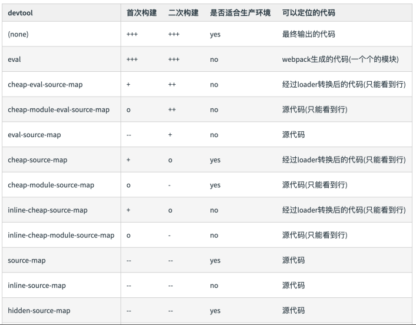

   

## 基础库分离

使⽤ html-webpackexternals-plugin  

```json
//npm i html-webpackexternals-plugin -D
plugins: [
    new HtmlWebpackExternalsPlugin({
      externals: [
        {
          module: "react",
          entry:
            "https://cdn.bootcss.com/react/16.13.1/umd/react.development.js",
          global: "React",
        },
        {
          module: "react-dom",
          entry:
            "https://cdn.bootcss.com/react-dom/16.13.1/umd/react-dom.development.js",
          global: "ReactDOM",
        },
      ],
    }),
  ],
//同时需要在index.html写入cdn地址，这样生产打包以后可以使用线上资源
```

SplitChunksPlugin

webpack4内置，替代CommonsChunkPlugin插件

```json
//chunks 参数说明：
	//async 异步引⼊的库进⾏分离(默认)
	//initial 同步引⼊的库进⾏分离
	//all 所有引⼊的库进⾏分离(推荐)
//分离公共脚本
optimization: {
    splitChunks: {
        chunks: 'async',//
        minSize: 30000,
        maxSize: 0,//分离包的体积大小
        minChunks: 1,//设置最小引用次数为2
        maxAsyncRequests: 5,
        maxInitialRequests: 3,
        automaticNameDelimiter: '~',
        name: true,
        cacheGroups: {
            vendors: {
                test: /[\\/]node_modules[\\/]/,
                priority: -10
            }
        }
    }
}
//分离基础包
//test: 匹配出需要分离的包

optimization: {
    splitChunks: {
        cacheGroups: {
            commons: {
                test: /(react|react-dom)/,
                name: 'vendors',//打包之后包含上述包的JS
                chunks: 'all'
            }
        }
    }
}
//需要在index.html中手动引入vendors包，或者是添加到在HtmlWebpackExternalsPlugin中的chunks选项中
chunks:['vendors',pageName],


//分离公共文件
//minChunks设置最小引用次数为2
//minSize:分离的包体积的大小
optimization: {
    splitChunks: {
        minSize: 0,//所有引用的包都会被打包成commons
            cacheGroups: {
                commons: {
                    name: 'commons',
                    chunks: 'all',
                    minChunks: 2
                }
            }
        }
    }
}
//需要在index.html中手动引入commons包，或者是添加到在HtmlWebpackExternalsPlugin中的chunks选项中
chunks:['commons',pageName],
```

## tree shaking(摇树优化)

**概念：** 1 个模块可能有多个⽅法，只要其中的某个⽅法使⽤到了，则整个⽂件都会被打到bundle ⾥⾯去， tree shaking 就是只把⽤到的⽅法打⼊ bundle ， 没⽤到的⽅法会在uglify 阶段被擦除掉。  

1. **webpack 默认⽀持，在 .babelrc ⾥设置 modules: false 即可**

2. production mode的情况下默认开启  
3. **要求：必须是 ES6 的语法， CJS 的⽅式(require)不⽀持**

**DCE (Dead code elimination)**  

- **特点是代码不会被执⾏，不可到达**  
- **代码执⾏的结果不会被⽤到**  
- **代码只会影响死变量（只写不读）**  

**tree-shaking原理**

1. **利⽤ ES6 模块的特点:**
   - ·只能作为模块顶层的语句出现
   - · import 的**模块名只能是字符串常量**
   - · import binding 是 immutable的
   - 代码擦除： uglify 阶段删除⽆⽤代码  

## scope hoisting

**现象：构建后的代码存在⼤量闭包代码**  

⼤量作⽤域包裹代码，导致体积增⼤（模块越多越明显）  

运⾏代码时创建的函数作⽤域变多，内存开销变⼤  

**原理：** 将所有模块的代码按照引⽤顺序放在⼀个函数作⽤域⾥，然后适当的重命名⼀些变量以防⽌变量名冲突
**对⽐**: 通过 scope hoisting 可以减少函数声明代码和内存开销  

**模块转换分析**  

1. ·被 webpack 转换后的模块会带上⼀层包裹
2. **·import 会被转换成 __webpack_require**  
3. 打包出来的是⼀个 IIFE (匿名闭包)  
4. **modules 是⼀个数组，每⼀项是⼀个模块初始化函数**  
5. **__webpack_require ⽤来加载模块，返回 module.exports**  
6. 通过 WEBPACK_REQUIRE_METHOD(0) 启动程序  

**scope hoisting使用**

webpack3

```json
plugins: [
+ new webpack.optimize.ModuleConcatenationPlugin()
};
```

webpack4

```json
webpack mode 为 production 默认开启
必须是 ES6 语法， CJS(require) 不⽀持
```

## 代码分割

对于⼤的 Web 应⽤来讲，将所有的代码都放在⼀个⽂件中显然是不够有效的，特别是当你的某些代码块是在某些特殊的时候才会被使⽤到。 **webpack 有⼀个功能就是将你的代码库分割成chunks（语块），当代码运⾏到需要它们的时候再进⾏加载。**  

**适用场景**

1. **抽离相同代码到⼀个共享块**  
2. **脚本懒加载，使得初始下载的代码更⼩**  

**懒加载JS脚本的方式**

1. **CommonJS:require.ensure**

2. **ES6**:动态import(目前还没有原生支持，需要babel转换)

   ```json
   //
   npm install @babel/plugin-syntax-dynamic-import --save-dev
   //.babelrc文件
   {
   	"plugins":["@babel/plugin-syntax-dynamic-import"],
   }
   ```

## ESLint

基于 **eslint:recommend** 配置并改进  

ESLint执行落地

1. 和CI/CD集成


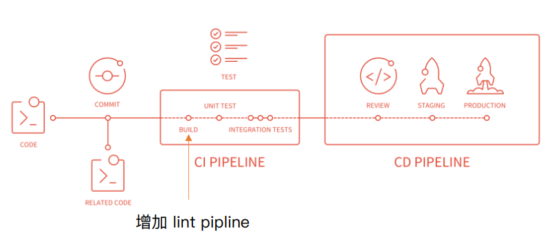

2.和webpack集成


```json
//npm install eslint-plugin-import eslint-plugin-react eslint-plugin-jsx-ally eslint-loader eslint-config-airbnb -D
//webpack.config.json
module: {
    rules: [
        {
            test: /\.js$/,
            exclude: /node_modules/,
            use: [
                "babel-loader",
                + "eslint-loader”
            ]
        }
    ]
}
//.eslintrc.js文件
module.exports = {
    "parser": "babel-eslint",//指定解析器
    "extends": "airbnb",//继承airbnb配置,继承多个写成数组
    "env": {
        "browser": true,//环境变量
        "node": true
    },
    "rules": {
        "indent": ["error", 4]
    }
};
```

本地开发阶段增加precommit钩子

```json
//安装husky

npm install husky --save-dev
//增加npm script 通过lint-staged增量检查修改的文件
"scripts": {
	"precommit": "lint-staged"
},
"lint-staged": {
    "linters": {
   	 	"*.{js,scss}": ["eslint --fix", "git add"]
    }
},
```


## 打包组件和JS库


```json
//暴露库
mode: "production",
entry: {
    "large-number": "./src/index.js",
    "large-number.min": "./src/index.js"
},
output: {
    filename: "[name].js",
    library: "largeNumber",//指定库的全局变量
    libraryExport: "default",//指定库的使用方式：default,可以不用new的方式
    libraryTarget: "umd"//库的引用方式
}
//.min的压缩，include设置只压缩min.js结尾的文件
// npm i terser-webpack-plugin -D 安装压缩库 ，webpack4内置生产环境下启用
mode:'none',//首先设置none
optimization: {
    minimize: true,
    minimizer: [
        new TerserPlugin({
        	include: /\.min\.js$/,
        }),
    ],
}
//设置入口文件：package.json的main字段为index.js
//package.json里增加钩子prepublish
"prepublish":"webpack"

//index.js文件
if (process.env.NODE_ENV === "production") {
module.exports = require("./dist/large-number.min.js");
} else {
module.exports = require("./dist/large-number.js");
}
```

`prepublish`这个钩子不仅会在`npm publish`命令之前运行，还会在`npm install`（不带任何参数）命令之前运行。这种行为很容易让用户感到困惑，所以 npm 4 引入了一个新的钩子`prepare`，行为等同于`prepublish`，而从 npm 5 开始，`prepublish`将只在`npm publish`命令之前运行。

## SSR

服务器渲染特点

- 所有模板等资源都存储在服务端  
- 内⽹机器拉取数据更快  
- ⼀个 HTML 返回所有数据  

SSR的优势

- 减少白屏时间
- 对SEO友好

SSR实现思路(React)

​		服务器

- 使⽤ react-dom/server 的 renderToString ⽅法将
  React 组件渲染成字符串  

- 服务端路由返回对应的模板  

  客户端

- 打包出针对服务端的组件  

webpack ssr打包存在的问题

- 浏览器的全局变量 (Node.js 中没有 document, window)  
  - 组件适配：将不兼容的组件根据打包环境进⾏适配  
  - 请求适配：将 fetch 或者 ajax 发送请求的写法改成 isomorphic-fetch 或者 axios  
- 样式问题 (Node.js ⽆法解析 css)  
  - 方案一:  服务端打包通过 ignore-loader 忽略掉 CSS 的解析  
  - 方案二:  将 style-loader 替换成 isomorphic-style-loader  

解决样式不显示的问题

- 使⽤打包出来的浏览器端 html 为模板  

- 设置占位符，动态插⼊组件  

⾸屏数据 处理

- 服务端获取数据  
- 替换占位符  

## ⽇志显示  


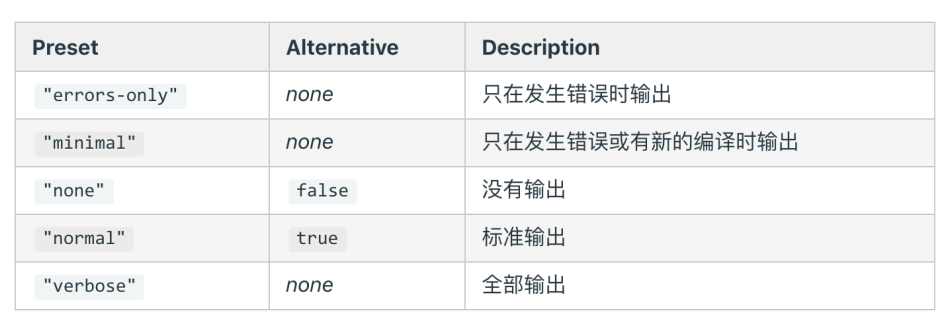

stats字段

```json
//mode: "production"时，直接设置stats
stats:'errors-only';
//开发环境下
devServer:{
    contentBase:'./dist',
    hot:true,
    stats:'errors-only'
}
```

使用friendly-errors-webpack-plugin  插件

```json
//npm i friendly-errors-webpack-plugin  -D
plugins: [
	+ new FriendlyErrorsWebpackPlugin()
],

```

##　构建异常和中断

1. 在 CI/CD 的 pipline 或者发布系统需要知道当前构建状态  每次构建完成后输⼊ echo $? 获取错误码  
2. webpack4 之前的版本构建失败不会抛出错误码 (error code)  
3. Node.js 中的 process.exit 规范  
   - 0 表示成功完成，回调函数中， err 为 null  
   - ⾮ 0 表示执⾏失败，回调函数中， err 不为 null， err.code 就是传给 exit 的数字  

**主动捕获处理构建错误**

```json
//compiler对象 在每次构建结束后会触发 done 这个 hook
//process.exit 主动处理构建报错

plugins: [
    function() {
        //webpack4:  this.hooks.done.tap()
        //webpack3:  this.plugin()
        this.hooks.done.tap('done', (stats) => {
            if (stats.compilation.errors && stats.compilation.errors.length && process.argv.indexOf('--watch') == -1)
            {
                console.log('build error');
                process.exit(1);//抛出错误码,数据上报
            }
        })
    }
]
```

# chapter4

## 构建包(dependencies)

1. 通过多个配置文件管理不同环境的构建， webpack --config 参数进行控制  (npm i webpack-merge -D )
2. 将构建配置设计成一个库， 比如： hjs-webpack、 Neutrino、 webpack-blocks  
3. 抽成一个工具进行管理， 比如： create-react-app, kyt, nwb  
4. 将所有的配置放在一个文件， 通过 --env 参数控制分支选择  

**ESLint规范构建脚本**

```json
//使用eslint-config-airbnb-base
//npm i eslint eslint-config-airbnb-base babel-eslint -D
// .eslintrc
module.exports = {
    "parser": "babel-eslint",
    "extends": "airbnb-base",
    "env": {
        "browser": true,
        "node": true
    }
};
//script命令
"eslint":"eslint --fix"
```

## 冒烟测试

指对提交测试的软件在进行详细深入的测试之前而进行的预测试  

```json
//安装删除库 npm i rimraf -D 
//安装测试库 npm i mocha -D
//安装glob-all npm i glob-all -D
```


## 单元测试

```json
// npm i mocha chai -D

//新建 test 目录， 并增加 xxx.test.js 测试文件

//script
"scripts": {
	"test": "node_modules/mocha/bin/_mocha”
},
```


## 持续集成

.travis.yml

## 发布到npm

添加用户： npm adduser

升级版本

- 升级补丁版本号： npm version patch
- 升级小版本号： npm version minor
- 升级大版本号： npm version major

发布版本： npm publish  

## Changelog 生成  

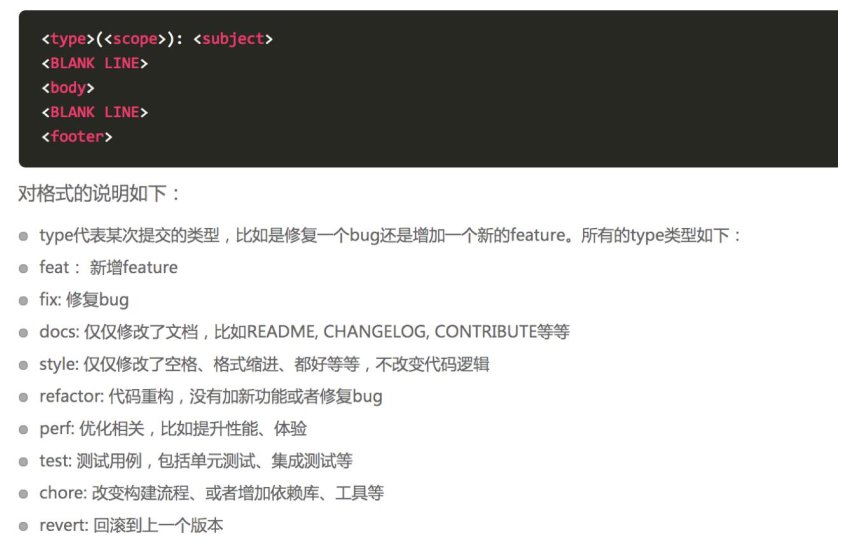

**本地开发阶段增加 precommit 钩子**  

```json
//npm install husky --save-dev
//通过 commitmsg 钩子校验信息
//package.json
"scripts": {
    "commitmsg": "validate-commit-msg",
    "changelog": "conventional-changelog -p angular -i CHANGELOG.md -s -r 0"
},
"devDependencies": {
    "validate-commit-msg": "^2.11.1",
    "conventional-changelog-cli": "^1.2.0",
    "husky": "^0.13.1"
}
```

## 项目版本信息  

1. 软件的版本通常由三位组成， 形如：X.Y.Z  
2. 在发布重要版本时， 可以发布alpha, rc等先行版本  
3. alpha和rc等修饰版本的关键字后面可以带上次数和meta信息  

**遵守 semver 规范的优势**  

1. 避免出现循环依赖
2. 依赖冲突减少  

**语义化版本（Semantic Versioning） 规范格式**  

1. 主版本号： 当你做了不兼容的 API 修改，  
2. 次版本号： 当你做了向下兼容的功能性新增  
3. 修订号： 当你做了向下兼容的问题修正  

**先行版本号**  

作为发布正式版之前的版本， 格式是在修订版本号后面加上一个连接号（-） ， 再加上一连串以点（.） 分割的标识符， 标识符可以由英文、 数字和连接号（[0-9A-Za-z-]） 组成。  

- alpha： 是内部测试版， 一般不向外部发布， 会有很多 Bug。 一般只有测试人员使用。
- beta： 也是测试版， 这个阶段的版本会一直加入新的功能。 在 Alpha 版之后推出
- rc： Release Candidate) 系统平台上就是发行候选版本。 RC 版不会再加入新的功能了， 主
  要着重于除错。 

# chapter5

## 初级分析：内置的 stats  

颗粒度太粗,难看出问题

```json
//package.json
"script":{
    "build:stats":"webpack --env production --json > stats.json",
}
```


## 速度分析： 

使用 speed-measure-webpack-plugin  可以看到每个 loader 和插件执行耗时  

```json
//npm i speed-measure-webpack-plugin --save-dev
const SpeedMeasureWebpackPlugin = require('speed-measure-webpack-plugin');
const smp = new SpeedMeasureWebpackPlugin();
const webpackConfig = smp.wrap({
  plugins: [new MyPlugin(), new MyOtherPlugin()],
});
```

**webpack-bundle-analyzer  分析体积**

```json
//npm install --save-dev webpack-bundle-analyzer
const BundleAnalyzerPlugin = require('webpack-bundle-analyzer').BundleAnalyzerPlugin;

module.exports = {
  plugins: [
    new BundleAnalyzerPlugin()
  ]
}
//构架完成以后8888端口查看
```

**使用高版本的 webpack 和 Node.js  提高构建速度**

1. V8 带来的优化（for of 替代 forEach、 Map 和 Set 替代 Object、 includes 替代 indexOf）  
2. 默认使用更快的 md4 hash 算法  
3. webpacks AST 可以直接从 loader 传递给 AST， 减少解析时间  
4. 使用字符串方法替代正则表达式  

## 多进程/多实例构建：

 资源并行解析可选方案  

1. (we'b'pack3 )使用 HappyPack 解析资源:每次 webapck 解析一个模块， HappyPack 会将它及它的依赖分配给 worker 线程中  

   

2. 使用 thread-loader (webpack4):每次 webpack 解析一个模块， threadloader 会将它及它的依赖分配给 worker 线程中  

   ```json
   //npm install --save-dev thread-loader
    rules: [
         {
           test: /\.js$/,
           include: path.resolve('src'),
           use: [
             'thread-loader',
             // your expensive loader (e.g babel-loader) 放在最前(最后处理任务)
           ],
         },
       ],
   ```

   

3. 并行压缩  

   - 方法一： 使用 parallel-uglify-plugin 插件  

     ```json
     
     ```

   - (不支持ES6)uglifyjs-webpack-plugin 开启 parallel 参数  

     ```json
     
     ```

     

   - terser-webpack-plugin 开启 parallel 参数  

     ```json
     const TerserPlugin = require('terser-webpack-plugin');
      // optimization: {
         //     minimizer: [
         //         new TerserPlugin({
         //             parallel: true,
         //             cache: true
         //         })
         //     ]
         // },
     ```

     

   

## 分包： 

1. [设置 Externals ](#基础库分离)

2. 进一步分包： 预编译资源模块 (基础包和业务基础包打包成一个文件  )

   -  使用 DLLPlugin 进行分包  

   ```json
   //webpack.dll.js
   
   const path = require('path');
   const webpack = require('webpack');
   
   module.exports = {
       entry: {
           library: [
               'react',
               'react-dom'
           ]
       },
       output: {
           filename: '[name]_[chunkhash].dll.js',
           path: path.join(__dirname, 'build/library'),
           library: '[name]'
       },
       plugins: [
           new webpack.DllPlugin({
               name: '[name]_[hash]',
               path: path.join(__dirname, 'build/library/[name].json')// manifest.json的位置
           })
       ]
   };
   //package.json
   "dll":"webpack --config webpack.dll.js"
   ```

   - 使用 DllReferencePlugin 引用 manifest.json  

   ```json
   //在webpack.config.js引入
   module.exports={
       plugins:[
            new webpack.DllReferencePlugin({
               manifest: require('./build/library/library.json')
            }),
       ]
   }
   ```

## 缓存  

提升二次构建速度

1. babel-loader 开启缓存(**转换JS语法阶段**)

   ```json
       new HappyPack({
               // 3) re-add the loaders you replaced above in #1:
               loaders: [ 'babel-loader?cacheDirectory=true' ]
           }),
   ```

   

2. terser-webpack-plugin 开启缓存(**代码压缩阶段**)

   ```json
    // optimization: {
       //     minimizer: [
       //         new TerserPlugin({
       //             parallel: true,
       //             cache: true
       //         })
       //     ]
       // },
   ```

   

3. 使用 cache-loader 或者 hard-source-webpack-plugin  (**提升模块转换阶段**)

   ```json
   //npm i --save-dev hard-source-webpack-plugin
   const HardSourceWebpackPlugin = require('hard-source-webpack-plugin');
   plugins:[
         new HardSourceWebpackPlugin(),
   ]
   ```

## 缩小构建目标  

```json
rules:{
    test: /.js$/,
    include: path.resolve('src'),//包含
    use: [
        'happypack/loader'
    ],
    exclude:'node_modules'//排除
}
```

减少文件搜索范围

```json
//resolve.modules设置
//resolve.mainFields配置
//resolve.extensions配置
//合理使用alias
   resolve: {
        alias: {
             'react': path.resolve(__dirname, './node_modules/react/umd/react.production.min.js'),
             'react-dom': path.resolve(__dirname, './node_modules/react-dom/umd/react-dom.production.min.js'),
        },
       modules:[path.resolve(__dirname,'node_modules')],
       extensions: ['.js'],//查找文件查找类型
       mainFields: ['main']
     }
```

## 图片压缩

要求： 基于 Node 库的 imagemin 或者 tinypng API  

- Imagemin的优点分析  
  - 支持定制选项
  - 第三方优化插件pngquant
  - 可以处理多种图片格式

使用： 配置 image-webpack-loader  

```json
//$ npm install image-webpack-loader --save-dev
rules: [{
  test: /\.(gif|png|jpe?g|svg)$/i,
  use: [
    'file-loader',
    {
      loader: 'image-webpack-loader',
      options: {
        mozjpeg: {
          progressive: true,
        },
        // optipng.enabled: false will disable optipng
        optipng: {
          enabled: false,
        },
        pngquant: {
          quality: [0.65, 0.90],
          speed: 4
        },
        gifsicle: {
          interlaced: false,
        },
        // the webp option will enable WEBP
        webp: {
          quality: 75
        }
      }
    },
  ],
}]
```

## 擦出无用CSS

PurifyCSS: 遍历代码， 识别已经用到的 CSS class  

```json
// npm i purgecss-webpack-plugin -D
//和 mini-css-extract-plugin 配合使用
```

uncss: HTML 需要通过 jsdom 加载， 所有的样式通过PostCSS解析， 通过document.querySelector 来识别在 html 文件里面不存在的选择器  

```json
const MiniCssExtractPlugin = require('mini-css-extract-plugin');
const PurgecssPlugin = require('purgecss-webpack-plugin');
//定义paths
const PATHS = {
    src: path.join(__dirname, 'src')
};

module:{
    rules:[
       {
                test: /.css$/,
                use: [
                    MiniCssExtractPlugin.loader,
                    'css-loader'
                ]
       },
	],
},
plugins:[
      new MiniCssExtractPlugin({
            filename: '[name]_[contenthash:8].css'
        }),
      new PurgecssPlugin({
            paths: glob.sync(`${PATHS.src}/**/*`,  { nodir: true }),//绝对路径,支持多路径
        })
]
```

## 构建体积优化： 动态 Polyfill  

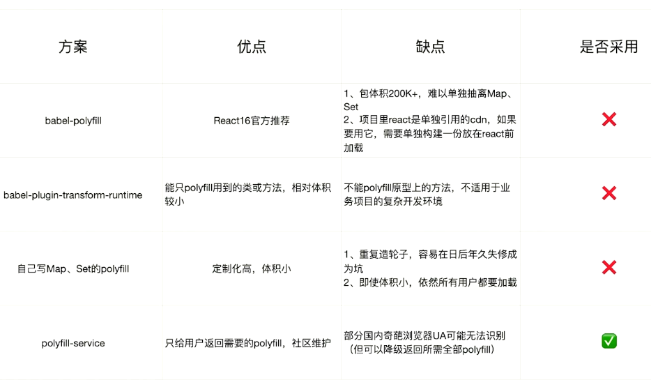

**Polyfill Service原理 : 识别 User Agent， 下发不同的 Polyfill**  

polyfill.io 官方提供的服务  

```json
<script src="https://polyfill.io/v3/polyfill.min.js"></script>
```

# chapter 6

## webpack启动过程

npm script启动webpack

- 开发环境： npm run dev  
- 生产环境： npm run build  

webpack直接运行

- webpack entry.js bundle.js  

查找webpack入口文件

- 在运行以上命令以后,npm会让命令行工具进入**node_modules\.bin 目录**查找是否存在 **webpack.sh** 或者 **webpack.cmd** 文件， 如果存在， 就执行， 不存在， 就抛出错误。  
- 实际的入口文件是： **node_modules\webpack\bin\webpack.js**  

webpack.js文件

```json
process.exitCode = 0; //1. 正常执行返回

const runCommand = (command, args) =>{...}; //2. 运行某个命令
                                      
const isInstalled = packageName =>{...}; //3. 判断某个包是否安装
                                   
const CLIs =[...]; //4. webpack 可用的 CLI: webpack-cli 和webpack-command
             
const installedClis = CLIs.filter(cli => cli.installed); //5. 判断是否两个 ClI 是否安装了
                                   
if (installedClis.length === 0){...}else if   //6. 根据安装数量进行处理
(installedClis.length === 1){...}else{...}
```

启动后的结果  

```json
webpack 最终找到 webpack-cli (webpack-command) 这个 npm 包， 并且
执行 CLI
```

**webpack-cli的作用**

- 引入 **yargs**， 对命令行进行定制  

- 分析命令行参数， 对各个参数进行转换， **组成编译配置项**  

- 引用webpack， 根据配置项进行**编译和构建**  

- 从**NON_COMPILATION_CMD常量**分析出不需要编译的命令  

  ```json
  const { NON_COMPILATION_ARGS } = require("./utils/constants");
  const NON_COMPILATION_CMD = process.argv.find(arg => {
      if (arg === "serve") {
          global.process.argv = global.process.argv.filter(a => a !== "serve");
          process.argv = global.process.argv;
      }
      	return NON_COMPILATION_ARGS.find(a => a === arg);
      });
      if (NON_COMPILATION_CMD) {
      	return require("./utils/prompt-command")(NON_COMPILATION_CMD,...process.argv);
  }
  ```

  

- **NON_COMPILATION_ARGS的内容**  

  ```json
  //webpack-cli提供的不需要编译的命令
  const NON_COMPILATION_ARGS = [
      "init", 	//创建一份 webpack 配置文件
      "migrate", 	//进行 webpack 版本迁移
      "add", 		//往 webpack 配置文件中增加属性
      "remove", 	//往 webpack 配置文件中删除属性
      "serve", 	//运行 webpack-serve
      "generate-loader", //生成 webpack loader 代码
      "generate-plugin", //生成 webpack plugin 代码
      "info” 		//返回与本地环境相关的一些信息
  ];
  ```

- 命令行工具包 yargs  

  ```json
  提供命令和分组参数
  动态生成 help 帮助信息
  ```

  ```json
  参数分组 (config/config-args.js)， 将命令划分为9类：
  ·Config options: 配置相关参数(文件名称、 运行环境等)
  ·Basic options: 基础参数(entry设置、 debug模式设置、 watch监听设置、 devtool设置)
  ·Module options: 模块参数， 给 loader 设置扩展
  ·Output options: 输出参数(输出路径、 输出文件名称)
  ·Advanced options: 高级用法(记录设置、 缓存设置、 监听频率、 bail等)
  ·Resolving options: 解析参数(alias 和 解析的文件后缀设置)
  ·Optimizing options: 优化参数
  ·Stats options: 统计参数
  ·options: 通用参数(帮助命令、 版本信息等)
  ```

  

- webpack-cli 执行的结果  

  ```json
  webpack-cli对配置文件和命令行参数进行转换最终生成配置选项参数 options
  最终会根据配置参数实例化 webpack 对象， 然后执行构建流程
  ```

  

- webpack的本质

  ```
  可以将其理解是一种基于事件流的编程范例， 一系列的插件运行。
  ```

  

## tapable

核心对象**compiler**和核心对象**compilation**都继承自**tapable**

Tapable 是一个类似于 **Node.js 的 EventEmitter** 的库, 主要是**控制钩子函数的发布与订阅**,控制着 webpack 的插件系统  

Tapable库暴露了很多 Hook（钩子） 类， 为插件提供挂载的钩子  

```json
const {
    SyncHook, //同步钩子
    SyncBailHook, //同步熔断钩子
    SyncWaterfallHook, //同步流水钩子
    SyncLoopHook, //同步循环钩子
    AsyncParallelHook, //异步并发钩子
    AsyncParallelBailHook, //异步并发熔断钩子
    AsyncSeriesHook, //异步串行钩子
    AsyncSeriesBailHook, //异步串行熔断钩子
    AsyncSeriesWaterfallHook //异步串行流水钩子
} = require("tapable");
```

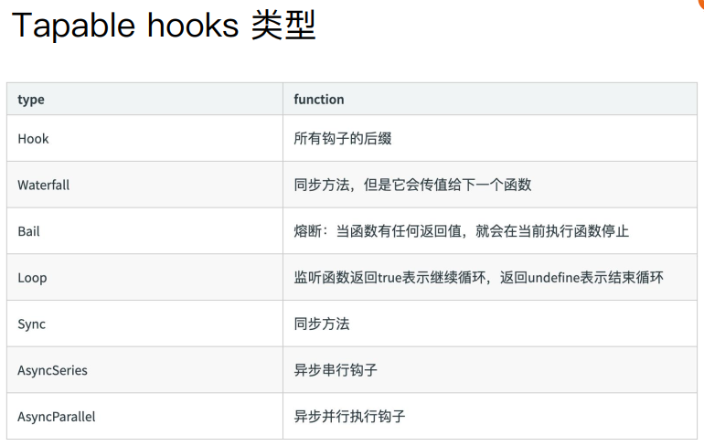

**tapable的使用**

- Tapable 暴露出来的都是类方法， new 一个类方法获得我们需要的钩子  
- class 接受数组参数 options ， 非必传。 类方法会根据传参， 接受同样数量的参数。  

**钩子的绑定与执行**  

- Tabpack 提供了同步&异步绑定钩子的方法， 并且他们都有绑定事件和执行事件对
  应的方法  

  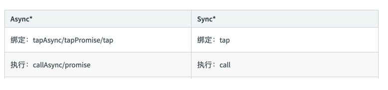

## Tapable 是如何和 webpack 联系起来的  

## Webpack 流程篇  

webpack的编译都按照下面的钩子调用顺序执行  

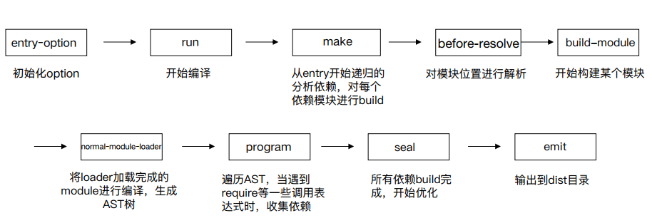

- **WebpackOptionsApply**  

将所有的配置 options 参数转换成 webpack 内部插件
使用默认插件列表 

举例：

```json
·output.library -> LibraryTemplatePlugin
·externals -> ExternalsPlugin
·devtool -> EvalDevtoolModulePlugin, SourceMapDevToolPlugin
·AMDPlugin, CommonJsPlugin
·RemoveEmptyChunksPlugin   
```

- Compiler hooks  
  - 流程相关：
    ·(before-)run
    ·(before-/after-)compile
    ·make
    ·(after-)emit
    ·done
  - 监听相关：
    ·watch-run
    ·watch-close  
- Compilation
  - Compiler 调用 Compilation 生命周期方法
    ·addEntry -> addModuleChain
    ·finish (上报模块错误)
    ·seal  
- ModuleFactory
- Module
- NormalModule
- Compilation hooks  
- Chunk 生成算法
- 模块化： 增强代码可读性和维护性  ll

```javascript
ES module
import * as largeNumber from 'large-number';
// ...
largeNumber.add('999', '1');

CJS

const largeNumbers = require('large-number');
// ...
largeNumber.add('999', '1');


AMD
require(['large-number'], function (large-number) {
// ...
largeNumber.add('999', '1');
});
```

- AST 基础知识  
  - 抽象语法树（abstract syntax tree 或者缩写为 AST） ， 或者语法树（syntax tree） ， 是
    源代码的抽象语法结构的树状表现形式， 这里特指编程语言的源代码。 树上的每个节点都
    表示源代码中的一种结构。  [演示](https://esprima.org/demo/parse.html)

## webpack模块机制

1. 打包出来的是一个 IIFE (匿名闭包)  
2. modules 是一个数组， 每一项是一个模块初始化函数  
3. __webpack_require 用来加载模块， 返回 module.exports  
4. 通过 WEBPACK_REQUIRE_METHOD(0) 启动程序  

## 简易webpack

```json
可以将 ES6 语法转换成 ES5 的语法
	通过 babylon 生成AST
·	通过 babel-core 将AST重新生成源码
可以分析模块之间的依赖关系
	通过 babel-traverse 的 ImportDeclaration 方法获取依赖属性
生成的 JS 文件可以在浏览器中运行
	
```

